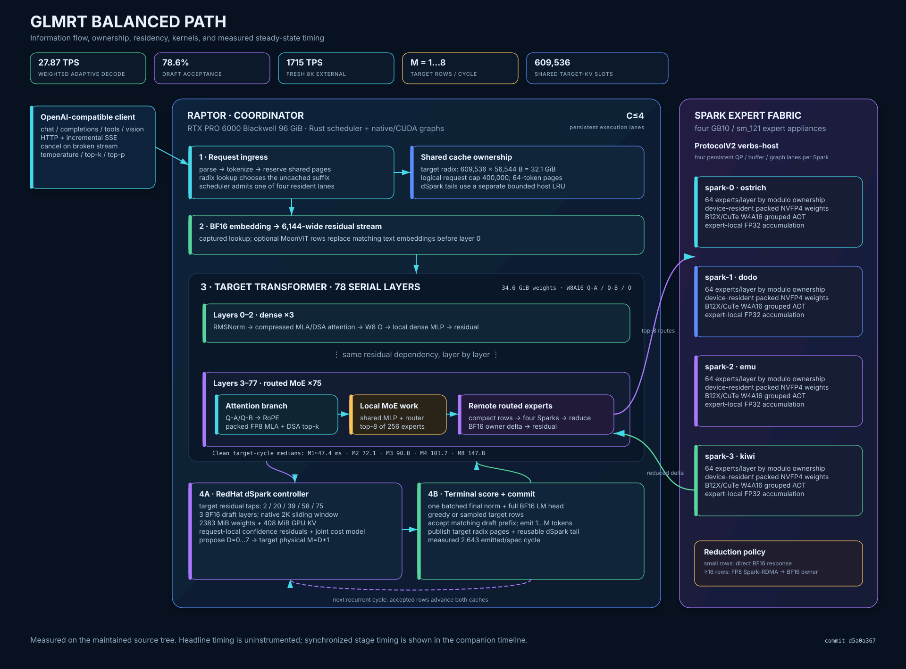
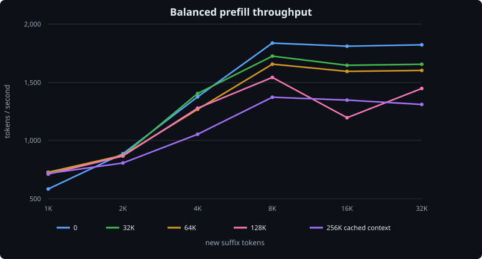
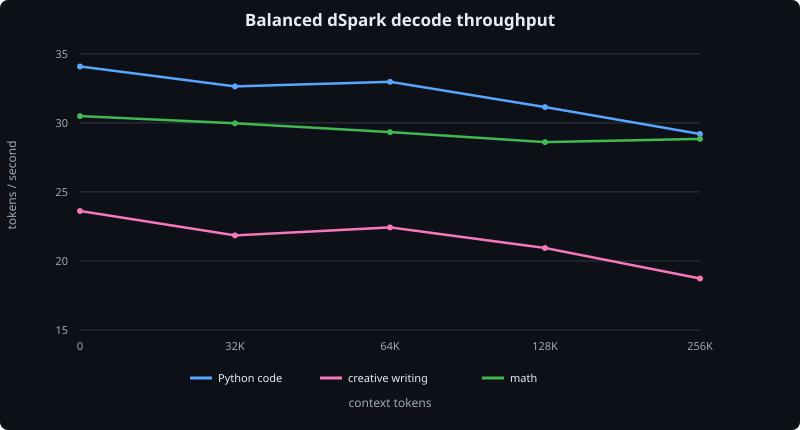
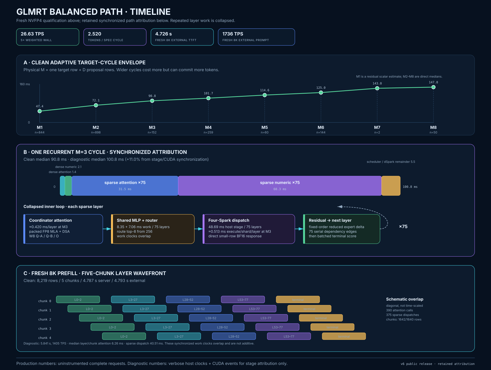

# GLMRT - LLM engine for GLM 5.2

## 4x Spark + 1x RTX 6000 @ 65 tok/s decode + 1,750 tok/s prefill

<sub>X.com style headline low-entropy prompt test</sub>

## What

GLMRT is a Rust-based Attention–FFN Disaggregation (AFD) inference engine for
GLM-5.2. It runs the model across one RTX PRO 6000 Blackwell 96 GB coordinator
and four NVIDIA DGX Sparks: the coordinator handles attention, scheduling,
cache, sampling, and the OpenAI-compatible API, while the Sparks run the routed
MoE experts.

It supports the `lukealonso/GLM-5.2-NVFP4` and `nvidia/GLM-5.2-NVFP4` exports,
continuous batching, long context, tool use, reasoning, vision, and plain,
native-MTP, or dSpark decoding. It is built for this particular hardware
layout, but is open source for anyone who wants to adapt it to their own.
It is also zippy in `balanced` mode: about 35 TPS on real Python coding and
about 1,800 TPS on large prefills.

## Why

I wanted a high-quality local GLM-5.2 using the hardware I already had, and a
custom AFD engine was the best way to make the large GPU and four Sparks work
together.

I built GLMRT for fun in an agentic process lasting roughly 30 days. One agent
did the implementation; a second was a discussion partner that helped sharpen
my thinking before I gave instructions to the coding agent. The project
started with GPT-5.5 + DeepSeek V4 Pro and later switched to GPT-5.6 Sol +
Grok 4.5, which was a big upgrade.

I am releasing it because it is cool, intelligence should be everywhere, and
it may be useful to someone building a customized inference engine for their
own hardware.

## Architecture

[](docs/balanced-path-architecture.svg)

The measured path, timing, residency, and data-movement details are described
in [`docs/balanced-path.md`](docs/balanced-path.md).

## How to use it

Clone the repository and edit the four Spark host names and network addresses
in `glmrt.config` for your setup. The other defaults can be left alone.

To build both Docker images and run GLMRT:

```bash
./build.sh
./run.sh
```

`build.sh` builds the coordinator image locally, builds the ARM expert image
on the first configured Spark, and copies it to the other Sparks.

To use the prebuilt images instead:

```bash
docker pull ghcr.io/tpurtell/glmrt-coordinator:latest

for host in spark-a spark-b spark-c spark-d; do
  ssh "$host" docker pull ghcr.io/tpurtell/glmrt-spark-expert:latest
done
```

Set the corresponding image names in `glmrt.config`:

```ini
COORDINATOR_DOCKER_INFERENCE=ghcr.io/tpurtell/glmrt-coordinator:latest
SPARK_EXPERT_DOCKER_INFERENCE=ghcr.io/tpurtell/glmrt-spark-expert:latest
```

Then run:

```bash
./run.sh
```

The server exposes an OpenAI-compatible API at
`http://localhost:8000/v1` by default. Model weights are not included; the
selected GLM-5.2 checkpoint must already be present in the Hugging Face cache
on each host.

## High Level Benchmarks

These results use the `balanced` profile and the hardware described above.

### Prefill

Each cell is the median of two requests and reports thousands of new suffix
tokens per second after the row's context was placed in the KV cache. The
server reported the exact requested suffix size for all 60 samples.

| Cached context | 1K | 2K | 4K | 8K | 16K | 32K |
|---:|---:|---:|---:|---:|---:|---:|
| 0 | 0.58 | 0.89 | 1.38 | 1.84 | 1.81 | 1.82 |
| 32K | 0.73 | 0.87 | 1.40 | 1.73 | 1.65 | 1.66 |
| 64K | 0.73 | 0.87 | 1.27 | 1.66 | 1.59 | 1.60 |
| 128K | 0.71 | 0.87 | 1.28 | 1.54 | 1.20 | 1.45 |
| 256K | 0.72 | 0.81 | 1.05 | 1.37 | 1.35 | 1.31 |



### Decode

Each cell is pooled server-side decode throughput from two responses with
thinking disabled. Code used the Python `merge_intervals` task with a 320-token
ceiling; every response ended naturally and passed its static contract check.
Writing and math used 192-token responses. dSpark accepted 71.5–79.6% of
drafted tokens across the matrix.

| Context | Code | Creative writing | Math |
|---:|---:|---:|---:|
| 0 | 34.08 | 23.62 | 30.49 |
| 32K | 32.64 | 21.85 | 29.97 |
| 64K | 32.97 | 22.43 | 29.33 |
| 128K | 31.14 | 20.94 | 28.61 |
| 256K | 29.19 | 18.73 | 28.84 |



### Concurrency

Three timed batches followed warm-up batches at each concurrency. Every
measured 320-token Python response passed a static syntax and contract check;
unique first-token nonces prevented prompt-cache reuse.

| Concurrent requests | Aggregate tok/s | Scaling | Median request tok/s | Median TTFT |
|---:|---:|---:|---:|---:|
| 1 | 33.25 | 1.00x | 33.25 | 439 ms |
| 2 | 50.98 | 1.53x | 26.40 | 825 ms |
| 4 | 57.43 | 1.73x | 15.36 | 1,551 ms |

### Pi coding-agent task

Pi 0.82.0 was run in an empty directory with the prompt `make a webgl game
of a parrot flying around to steal food from people`. Both results passed a
JavaScript syntax check and loaded and played in Chrome.

| Reasoning | Wall time | Model turns | Tool calls | Fresh input | Cache read | Output | Reasoning | Total tokens | Result |
|---|---:|---:|---:|---:|---:|---:|---:|---:|---|
| Off | 293.96 s | 5 | 4 | 1,413 | 30,194 | 8,842 | 0 | 40,449 | Good (8/10) |
| High | 284.51 s | 3 | 2 | 1,412 | 18,950 | 8,562 | 123 | 28,924 | Very good (8.5/10) |

The no-reasoning game made food and people easier to read during play and had
the richer picnic/shoo mechanic. The high-reasoning game had the more polished
world and onboarding, explicit click-to-steal reactions, and used 28% fewer
total tokens, although its targets were smaller at distance. Each was a
single-file Three.js game of about 24 KB.

### Needle in a haystack

Each exact-length prompt contained three unique secret codes embedded at
approximately 10%, 50%, and 90% depth in quoted repository source. With
thinking disabled, GLMRT returned all 12 codes in the requested order and exact
JSON-only format.

| Context | 10% | 50% | 90% |
|---:|:---:|:---:|:---:|
| 32K | Pass | Pass | Pass |
| 64K | Pass | Pass | Pass |
| 128K | Pass | Pass | Pass |
| 256K | Pass | Pass | Pass |

## Micro-timeline Benchmarks

[](docs/balanced-path-timeline.svg)

Agents customizing the engine should start with [`DEVELOPER.md`](DEVELOPER.md).
GLMRT is released under the [MIT License](LICENSE).

## Performance by Profile

| Profile | Weighted decode | Verify throughput | Acceptance | Fresh 8K prefill |
|---|---:|---:|---:|---:|
| Balanced | 28.34 tok/s | 30.46 tok/s | 78.2% | 1,725 tok/s |
| Long | 27.44 tok/s | 29.57 tok/s | 75.9% | 1,712 tok/s |
| Accurate | 23.21 tok/s | 25.36 tok/s | 85.0% | 966 tok/s |
