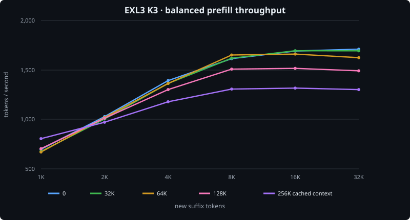
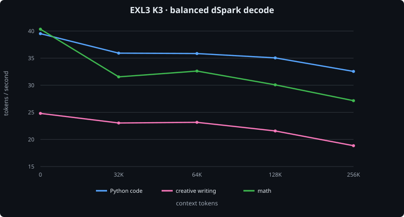
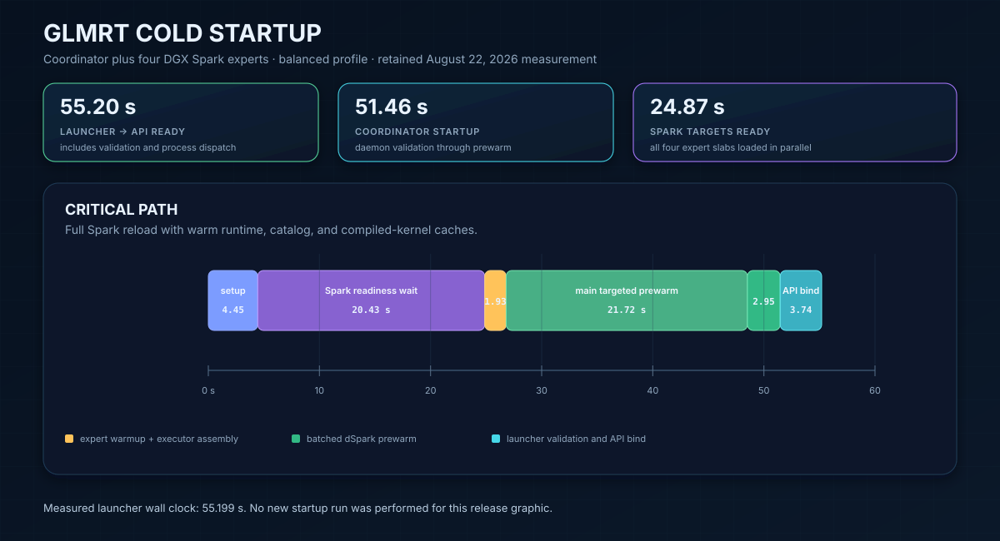

# GLMRT — GLM-5.2 inference engine

## 4x Spark + 1x RTX 6000 @ 71 tok/s decode + 1,800 tok/s prefill

<sub>X-style balanced-profile peaks: low-entropy EXL3 decode and fresh large NVFP4 prefill.</sub>

## What

GLMRT is a Rust-based Attention–FFN Disaggregation (AFD) inference engine for
GLM-5.2. One RTX PRO 6000 Blackwell 96 GB coordinator handles attention,
scheduling, KV cache, sampling, and the OpenAI-compatible API; four NVIDIA DGX
Sparks execute the routed MoE experts.

It supports the `lukealonso/GLM-5.2-NVFP4` and `nvidia/GLM-5.2-NVFP4`
exports, plus `wrldsuksgo2mars/GLM-5.2-EXL3-K3-calibrated-v1`. It provides
continuous batching, long context, tool use, reasoning, vision, and plain,
native-MTP, or dSpark decoding.

It is zippy in the balanced profile: about 35 tok/s on real Python coding with
NVFP4, about 40 tok/s with EXL3 K3, and up to 1,800 tok/s on large prefills.

## Why

I wanted a high-quality local GLM-5.2 using the hardware I already had, and a
custom AFD engine was the best way to make the large GPU and four Sparks work
together.

I built GLMRT for fun in an agentic process lasting roughly 30 days. One agent
implemented it; a second was a discussion partner that helped sharpen my
thinking before I gave instructions to the coding agent. The project started
with GPT-5.5 + DeepSeek V4 Pro and later switched to GPT-5.6 Sol + Grok 4.5,
which was a big upgrade.

I am releasing it because it is cool, intelligence should be everywhere, and
it may be useful to someone customizing an inference engine for their own
hardware.

## Architecture

[](docs/balanced-path-architecture.svg)

## How to use it

Clone the repository and edit the four Spark host names and network addresses
in `glmrt.config`. The other defaults can be left alone. Set `MODEL=luke`,
`MODEL=nvidia`, or `MODEL=exl3` to select a checkpoint already cached on all
five hosts.

Build and run both images:

```bash
./build.sh
./run.sh
```

`build.sh` builds the coordinator image locally, builds the ARM expert image
on the first configured Spark, and distributes it to the other Sparks.
Release maintainers can tag and push both current images as `v6` and `latest`
with `./push-containers.sh v6`.

To use the v6 images from GitHub Container Registry instead:

```bash
docker pull ghcr.io/tpurtell/glmrt-coordinator:v6

for host in spark-a spark-b spark-c spark-d; do
  ssh "$host" docker pull ghcr.io/tpurtell/glmrt-spark-expert:v6
done
```

Set the images in `glmrt.config` and run:

```ini
COORDINATOR_DOCKER_INFERENCE=ghcr.io/tpurtell/glmrt-coordinator:v6
SPARK_EXPERT_DOCKER_INFERENCE=ghcr.io/tpurtell/glmrt-spark-expert:v6
```

```bash
./run.sh
```

The server exposes an OpenAI-compatible API at `http://localhost:8000/v1` by
default. Model weights are not included; the selected checkpoint must already
exist in the Hugging Face cache on every host.

## High Level Benchmarks

All results below were measured on 4x DGX Spark + 1x RTX PRO 6000 96 GB with
dSpark speculation. Except for the profile comparison, every performance
measurement used the balanced profile.

| Checkpoint | Weighted decode | Python code | Low entropy | Large fresh prefill | Tool eval median | Needles |
|---|---:|---:|---:|---:|---:|---:|
| NVFP4 | 26.63 tok/s | 35.43 tok/s | 63.27 tok/s | 1,807 tok/s | 120/138 | 12/12 |
| EXL3 K3 | 28.49 tok/s | 39.51 tok/s | 70.86 tok/s | 1,710 tok/s | 123/138 | 12/12 |

Weighted decode is pooled wall throughput across five repeats of seven mixed
code, math, prose, short-response, exposition, JSON, and multilingual prompts.
Python is the zero-context `merge_intervals` workload. Low entropy requested
100 repetitions of `orchid`; both models over-repeated, so that number is a
speed-only X-style test.

### Prefill

Each cell is the median of two requests and reports new suffix tokens per
second after the row's context was placed in KV cache. Every retained sample
contained the exact requested number of new rows.

#### NVFP4

| Cached context | +1K | +2K | +4K | +8K | +16K | +32K |
|---:|---:|---:|---:|---:|---:|---:|
| 0 | 585 | 972 | 1,495 | 1,736 | 1,807 | 1,772 |
| 32K | 854 | 964 | 1,496 | 1,733 | 1,722 | 1,692 |
| 64K | 845 | 962 | 1,493 | 1,659 | 1,658 | 1,623 |
| 128K | 829 | 945 | 1,389 | 1,510 | 1,510 | 1,492 |
| 256K | 784 | 916 | 1,221 | 1,311 | 1,315 | 1,298 |


#### EXL3 K3

| Cached context | +1K | +2K | +4K | +8K | +16K | +32K |
|---:|---:|---:|---:|---:|---:|---:|
| 0 | 698 | 1,028 | 1,392 | 1,614 | 1,691 | 1,710 |
| 32K | 676 | 1,004 | 1,364 | 1,618 | 1,694 | 1,693 |
| 64K | 670 | 1,019 | 1,363 | 1,651 | 1,660 | 1,624 |
| 128K | 704 | 1,012 | 1,301 | 1,508 | 1,516 | 1,491 |
| 256K | 805 | 971 | 1,178 | 1,306 | 1,316 | 1,301 |



### Decode

Each cell is pooled server-side decode throughput from two deterministic
responses with thinking disabled.

#### NVFP4

| Context | Python code | Creative writing | Math |
|---:|---:|---:|---:|
| 0 | 35.43 | 22.51 | 32.90 |
| 32K | 33.07 | 22.04 | 28.32 |
| 64K | 30.35 | 22.96 | 26.85 |
| 128K | 32.74 | 19.77 | 30.58 |
| 256K | 28.86 | 18.84 | 26.78 |


#### EXL3 K3

| Context | Python code | Creative writing | Math |
|---:|---:|---:|---:|
| 0 | 39.51 | 24.80 | 40.34 |
| 32K | 35.92 | 23.03 | 31.49 |
| 64K | 35.85 | 23.15 | 32.60 |
| 128K | 35.05 | 21.57 | 30.08 |
| 256K | 32.55 | 18.91 | 27.15 |



### Concurrency

Each median covers three timed batches after two warm-up batches. Unique
first-token nonces prevented prompt-cache reuse, and every generated Python
response passed its static contract.

#### NVFP4

| Concurrent requests | Median aggregate | Scaling | Correct |
|---:|---:|---:|:---:|
| 1 | 35.01 tok/s | 1.00x | Yes |
| 2 | 49.53 tok/s | 1.41x | Yes |
| 4 | 59.48 tok/s | 1.70x | Yes |

#### EXL3 K3

| Concurrent requests | Median aggregate | Scaling | Correct |
|---:|---:|---:|:---:|
| 1 | 37.39 tok/s | 1.00x | Yes |
| 2 | 58.43 tok/s | 1.56x | Yes |
| 4 | 61.44 tok/s | 1.64x | Yes |

### Tool use

`tool-eval-bench` 2.3.2 ran all 69 scenarios serially with thinking enabled.
Each quant used three independent seeds. Parentheses show the tool's rounded
display score.

| Checkpoint | Run 1 | Run 2 | Run 3 | Median |
|---|---:|---:|---:|---:|
| NVFP4 | 120/138 (87) | 120/138 (87) | 121/138 (88) | 120/138 (87) |
| EXL3 K3 | 123/138 (89) | 123/138 (89) | 122/138 (88) | 123/138 (89) |

### Pi coding-agent task

Pi 0.82.0 ran in an empty directory with the prompt `make a webgl game of a
parrot flying around to steal food from people`. Every result was a single-file
Three.js game whose module JavaScript passed syntax validation.

#### NVFP4

| Reasoning | Wall time | Turns | Tool calls | Fresh input | Cache read | Output | Reasoning | Total | File |
|---|---:|---:|---:|---:|---:|---:|---:|---:|---:|
| Off | 285.24 s | 8 | 7 | 2,063 | 55,440 | 8,164 | 0 | 65,667 | 22.7 KB |
| High | 252.36 s | 2 | 1 | 1,361 | 8,363 | 7,472 | 123 | 17,196 | 21.1 KB |

#### EXL3 K3

| Reasoning | Wall time | Turns | Tool calls | Fresh input | Cache read | Output | Reasoning | Total | File |
|---|---:|---:|---:|---:|---:|---:|---:|---:|---:|
| Off | 276.35 s | 2 | 1 | 1,326 | 10,164 | 9,327 | 0 | 20,817 | 27.7 KB |
| High | 231.88 s | 2 | 1 | 1,331 | 8,434 | 7,498 | 110 | 17,263 | 21.1 KB |

`Total` is fresh input + cache read + output. Pi reports reasoning as a subset
of output, so it is shown but not added again.

### Needle in a haystack

Each exact-length prompt contained three unique secret codes at approximately
10%, 50%, and 90% depth in quoted repository source. Thinking was disabled;
both checkpoints returned all codes in order and exact JSON-only format.

#### NVFP4

| Context | 10% | 50% | 90% |
|---:|:---:|:---:|:---:|
| 32K | Pass | Pass | Pass |
| 64K | Pass | Pass | Pass |
| 128K | Pass | Pass | Pass |
| 256K | Pass | Pass | Pass |

#### EXL3 K3

| Context | 10% | 50% | 90% |
|---:|:---:|:---:|:---:|
| 32K | Pass | Pass | Pass |
| 64K | Pass | Pass | Pass |
| 128K | Pass | Pass | Pass |
| 256K | Pass | Pass | Pass |

## Micro-timeline Benchmarks

[](docs/balanced-path-timeline.svg)

## Startup Time

The retained cold-launch measurement is shown below. No new startup run was
performed for this release update.

[](docs/startup-timeline.svg)

## Performance by Profile

Only this section varies the serving profile. Weighted decode is the same
five-repeat mixed workload used above; prefill is a fresh +8K suffix over a 2K
cached base.

### NVFP4

| Profile | Weighted decode | Verify throughput | Acceptance | Fresh +8K prefill |
|---|---:|---:|---:|---:|
| Balanced | 26.63 tok/s | 28.97 tok/s | 75.2% | 1,604 tok/s |
| Long | 26.17 tok/s | 28.52 tok/s | 75.0% | 1,579 tok/s |
| Accurate | 21.67 tok/s | 23.64 tok/s | 83.0% | 1,055 tok/s |

### EXL3 K3

| Profile | Weighted decode | Verify throughput | Acceptance | Fresh +8K prefill |
|---|---:|---:|---:|---:|
| Balanced | 28.49 tok/s | 30.86 tok/s | 71.7% | 1,600 tok/s |
| Long | 28.62 tok/s | 31.01 tok/s | 73.1% | 1,685 tok/s |
| Accurate | 23.09 tok/s | 25.21 tok/s | 83.0% | 1,058 tok/s |

Agents customizing the engine should start with [`DEVELOPER.md`](DEVELOPER.md).
GLMRT is released under the [MIT License](LICENSE).
